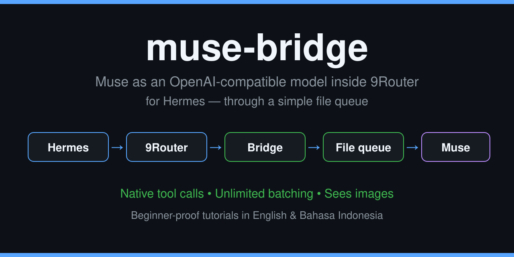

# muse-bridge




> 🇬🇧 English version: [README.md](README.md)

**Mengubah Muse (agent AI) menjadi model di dalam 9Router, supaya bisa
dipakai Hermes persis kayak model API beneran — lengkap dengan tool calls.**

---

<div align="center">

## 🎁 BELUM PUNYA MUSE? KLAIM BONUS 1 MILIAR TOKEN

### Kode referral: `IB4FJR`

Tukarkan kode ini di Settings Muse **dalam 48 jam setelah bergabung** dan
kita berdua mendapatkan **1 miliar token Muse**.

**👉 [Baca tutorial klaim Muse — pakai VPN & tanpa VPN](docs/CLAIM-MUSE.id.md)**

</div>

---

Dokumen ini ditulis buat **orang yang sangat awam**. Nggak apa-apa kalau
kamu baru pertama kali dengar istilah-istilah di sini — semuanya dijelasin
pelan-pelan dari nol. Baca dari atas ke bawah, jangan loncat-loncat dulu.

---

## 1. Penjelasan 30 detik (bahasa bayi)

Bayangin sebuah restoran:

- **Hermes** itu **pelayan**. Dia yang ngobrol sama kamu lewat Telegram,
  dan dia yang punya **tangan** buat ngerjain sesuatu di komputer (VPS)
- **Muse** itu **koki pinter**. Dia yang **mikir**. Tapi masalahnya: koki
  ini tinggal di **rumah lain**, dan dia **nggak punya telepon** — nggak
  ada API yang bisa dipanggil buat nyuruh dia mikir
- Project ini bikin jalan pintas: pesanan dari pelayan **ditulis jadi
  file** di sebuah "buku catatan" (namanya **bridge**), ada **kurir** yang
  tiap 5 detik ngecek buku itu dan bangunin koki, koki nulis jawabannya,
  kurir nganterin balik

Hasil akhirnya: di dalam 9Router kamu muncul model bernama **`ms/muse`**.
Hermes bisa milih model itu kayak milih ChatGPT atau DeepSeek. Model itu
bisa ngobrol, bisa **minta tolong jalanin perintah beneran di VPS** (itu
yang namanya *tool calls*), dan bisa **lihat gambar** yang kamu kirim.

Kenapa ini keren? Karena yang jawab itu **agent beneran** — dia punya
ingatan, bisa mikir panjang, dan bisa beneran kerja — bukan model mentah
yang cuma bisa ngomong.

## 2. Kenapa orang mau pakai ini?

- Kamu punya agent AI (Muse) yang pinter, tapi program lain (Hermes)
  nggak bisa manggil dia karena dia nggak punya API
- Kamu mau agent itu muncul sebagai **salah satu pilihan model** di
  9Router kamu, biar bisa dipakai dari Telegram lewat Hermes
- Kamu mau agent itu bisa **beneran ngecek mesin kamu** (disk penuh
  nggak, service hidup nggak, log error apa) — bukan ngarang jawaban
- Kamu mau semua itu **tanpa buka port baru ke internet** dan **tanpa
  ngasih kunci rumah kamu ke sembarang pihak** — perintah berbahaya tetap
  harus lewat izin kamu dulu (dijelasin di Bab 9)

## 3. Siapa yang cocok pakai ini, siapa yang nggak

**Cocok buat kamu kalau:**

- Kamu sudah punya VPS dan sudah jalanin 9Router + Hermes di sana
- Kamu punya akses ke Muse (agent-nya) yang bisa dipasangi *hook*
  (script pengecek berkala)
- Kamu sabar nunggu jawaban 25–35 detik per putaran demi jawaban yang
  beneran dari data asli

**Nggak cocok / jangan pakai kalau:**

- Kamu butuh jawaban super cepat kayak API beneran (2–5 detik). Sistem
  ini **nggak akan pernah** secepat itu. Alasannya dijelasin di Bab 10
- Kamu belum punya 9Router dan Hermes sama sekali — beresin itu dulu,
  baru balik ke sini
- Kamu nggak pegang akses root/admin ke VPS kamu sendiri

## 4. Kamus kecil (istilah yang bakal sering muncul)

Baca ini dulu biar nggak bingung di tengah jalan:

| Istilah | Artinya pakai bahasa manusia |
|---|---|
| **VPS** | Komputer sewaan yang nyala 24 jam di internet. "Server" kamu |
| **API** | Cara resmi program ngomong ke program lain lewat request dan jawaban |
| **Model** | "Otak" yang menjawab chat. Contoh: GPT, DeepSeek, Claude — dan sekarang: `ms/muse` |
| **Provider** | "Merek"/sumber model di dalam 9Router. Punya kita mereknya `ms` |
| **Combo** | Nama panggilan pendek. Combo `muse` isinya `ms/muse`, jadi manggilnya cukup `muse` |
| **9Router** | Program yang ngatur semua model di VPS kamu — kayak buku pesanan pintar yang tahu pesanan ini buat model yang mana |
| **Hermes** | Program agent yang kamu pakai chat (misalnya lewat Telegram). Dia yang punya tool/tangan |
| **Bridge** | Program kecil jembatan di tengah. Di project ini: yang nerima request dan nyimpennya jadi file antrean |
| **Queue / antrean** | Folder tempat file pesanan nunggu dijawab (`pending`) dan jawaban yang sudah jadi (`done`) |
| **Tool** | Alat yang Hermes punya, misalnya terminal buat jalanin perintah di VPS |
| **Tool calls** | Surat dari model isinya "tolong jalanin alat ini". Model nggak jalanin sendiri — Hermes yang jalanin |
| **SSH** | Cara aman masuk ke komputer lain dari jauh. Kurir pakai ini buat bolak-balik ke VPS |
| **Hook / kurir** | Script kecil yang jalan tiap beberapa detik buat ngecek "ada pesanan baru nggak?" |
| **Worker / pekerja** | Si Muse yang kebangun buat jawab satu pesanan |
| **Prompt** | Buku aturan/instruksi yang dibaca pekerja sebelum kerja |
| **Token** | Satuan "bahan bakar" mikirnya AI. Makin banyak yang dibaca/ditulis, makin banyak token kepakai |
| **Approval / persetujuan** | Hermes nanya kamu dulu ("perintah ini jalanin nggak?") sebelum ngerjain yang berbahaya |
| **`/yolo`** | Mode di Hermes yang matiin pertanyaan persetujuan — semua langsung jalan. Berbahaya kalau ditinggal nyala |

## 5. Yang harus kamu punya dulu (cek satu-satu)

Jangan mulai pasang sebelum semua ini centang:

- [ ] **Satu VPS Linux** dan kamu pegang akses **root**-nya
- [ ] **9Router sudah terpasang dan jalan** di VPS itu (biasanya port
  `20128`). Cara ngecek: dashboard-nya bisa dibuka
- [ ] **Hermes sudah terpasang** di VPS yang sama dan **sudah nyambung
  ke 9Router itu** (pakai model apa pun dulu, yang penting bisa chat)
- [ ] **Satu agent Muse** di tempat lain yang punya fitur **hook**
  (script yang bisa jalan tiap beberapa detik dan bisa membangunkan
  agent). Belum punya akun Muse? Ikuti
  [tutorial klaim Muse](docs/CLAIM-MUSE.id.md) — tersedia jalur VPN dan
  tanpa VPN — lalu tukarkan kode referral **`IB4FJR`** dalam 48 jam untuk
  bonus 1 miliar token
- [ ] **SSH dari tempat Muse ke VPS bisa**, pakai kunci (key), bukan
  password. Cara ngecek: perintah `ssh user@alamat-vps "echo halo"`
  berhasil dari mesin Muse

Kalau ada yang belum centang, itu bukan salah kamu — memang harus
berurutan. Selesaikan yang kurang dulu (buat 9Router dan Hermes ada
tutorialnya masing-masing), baru balik ke sini.

## 6. Isi repo ini, file per file

Biar kamu nggak takut sama foldernya — ini semua isinya dan gunanya:

| File / folder | Gunanya, bahasa manusia |
|---|---|
| `README.md` | Dokumen ini versi Bahasa Inggris |
| `README.id.md` | Dokumen ini (yang lagi kamu baca) |
| `docs/TUTORIAL.id.md` | **Tutorial lengkap Bahasa Indonesia, langkah demi langkah** — ini bacaan utama buat masang |
| `docs/TUTORIAL.md` | Tutorial yang sama versi Bahasa Inggris |
| `docs/CLAIM-MUSE.id.md` | **Tutorial klaim akun Muse pakai VPN & tanpa VPN**, lengkap dengan highlight kode referral `IB4FJR` |
| `docs/CLAIM-MUSE.md` | Tutorial klaim Muse yang sama versi Bahasa Inggris |
| `docs/FASE1-SAFETY-SPEC.md` | Catatan rencana fase berikutnya (pekerja paralel, antrean lebih besar) + catatan keamanannya |
| `bridge/bridge.py` | **Program bridge yang jalan sekarang (v4)** — yang support tool calls |
| `bridge/bridge-v1.py` | Bridge versi pertama (cuma bisa teks). Disimpan sebagai sejarah & bahan perbandingan |
| `worker/worker-prompt-v3.txt` | **Buku aturan pekerja yang dipakai sekarang** — ada aturan tool call tanpa batas, aturan gambar/media, dan aturan kejujuran |
| `worker/worker-prompt-v2-backup-20261002.txt` | Buku aturan versi sebelumnya. Buat cadangan kalau mau balikin (rollback) |
| `scripts/auto-install.sh` | **Pemasang otomatis Linux & macOS** — satu perintah, sisanya dipandu |
| `scripts/auto-install.ps1` | **Pemasang otomatis Windows** |
| `scripts/install-linux.sh` | Pemasang bridge saja untuk Linux (dipanggil oleh auto-install) |
| `scripts/install-macos.sh` | Pemasang bridge saja untuk macOS |
| `scripts/install-windows.ps1` | Pemasang bridge saja untuk Windows |
| `tools/ssh-vps.sh` | Jalan pintas (wrapper) SSH ke VPS, dipakai kurir |
| `tools/scp-vps.sh` | Jalan pintas copy file ke/dari VPS |
| `tests/test_bridge_v2.py` | Unit test bridge (pakai pekerja palsu) — 9/9 lulus |
| `tests/test-on-vps.sh` | Script tes langsung ke bridge di VPS (chat, streaming, tool calls) |
| `tests/test-via-9router.py` | Script tes lewat 9Router (bukti tool calls nggak dipotong di tengah) |
| `tests/test_prompt_v3.py` | Tes aturan pekerja v3: batch tool call, gambar, anti-ketuker antar sesi — 3/3 lulus live |

## 7. Cara pasang — pilih jalan kamu

Ada dua jalan. Hasil akhirnya sama.

### Jalan Cepat — script auto-install (disarankan)

Script-nya yang ngerjain bagian bridge secara otomatis (bikin folder,
masang programnya, daftarin jadi service yang nyala terus, ngecek
kesehatan), terus **memandu kamu** di 3 langkah pendek yang memang cuma
bisa diklik manusia (daftarin provider di dashboard 9Router, pasang kurir
di sisi Muse, arahin model Hermes). Semua nilai yang harus ditempel
sudah ditulis persis di panduannya — tinggal copy-paste.

**Linux / macOS** (dari folder repo ini):

```bash
bash scripts/auto-install.sh
```

**Windows** (dari folder repo ini, pakai PowerShell):

```powershell
powershell -ExecutionPolicy Bypass -File scripts\auto-install.ps1
```

### Jalan Manual — tutorial lengkap

Kalau kamu mau ngerti setiap bautnya (atau script-nya error di mesin
kamu), ikuti tutorialnya. Ada 10 bagian, dari "kita mau bikin apa" sampai
"kalau ada masalah":

Belum punya akun Muse? Mulai dari
**[tutorial klaim Muse](docs/CLAIM-MUSE.id.md)** dulu — ada jalur VPN
dan tanpa VPN, plus kode referral **`IB4FJR`** yang di-highlight di sana.

- 🇮🇩 **[docs/TUTORIAL.id.md](docs/TUTORIAL.id.md)** — Bahasa Indonesia,
  bahasa bayi, pemula pasti bisa
- 🇬🇧 **[docs/TUTORIAL.md](docs/TUTORIAL.md)** — English version

### Gambaran langkah besarnya (dua jalan sama-sama lewat sini)

1. **Bridge dipasang di VPS** — folder antrean + program + service
2. **Kunci SSH** dari mesin Muse ke VPS disiapkan
3. **Provider `muse` didaftarkan di 9Router** — lewat **dashboard**
   (jangan suntik database langsung; kami sudah pernah coba dan hasilnya
   setengah rusak. Di tutorial dijelasin kenapa)
4. **Combo `muse`** dibuat, isinya `["ms/muse"]`, plus satu **API key
   9Router** buat klien
5. **Kurir + buku aturan pekerja dipasang di sisi Muse** (hook yang
   ngecek tiap 5 detik + prompt pekerja v3)
6. **Hermes diarahkan** ke model `muse` di salah satu profilnya
7. **Dites satu-satu** — ada 7 tes dengan tanda lulusnya di tutorial
   Bagian 7

## 8. Gimana cara kerjanya sehari-hari

Satu pesan kamu, perjalanannya begini (pelan-pelan):

1. Kamu chat di Telegram: "cek disk VPS pakai tool"
2. Hermes nerusin pesan itu ke 9Router, dan 9Router nerusin ke bridge
   (karena modelnya `ms/muse`)
3. Bridge nyimpen pesan itu jadi **satu file** di folder `pending`, terus
   bridge **nunggu**
4. Dalam maksimal 5 detik, **kurir** di sisi Muse lihat ada file baru,
   terus **bangunin satu pekerja**
5. Pekerja baca file-nya. Isinya bukan cuma pesan kamu — tapi **seluruh
   riwayat chat sesi itu + daftar tool yang Hermes punya**. Makanya
   ukurannya gede (sesi asli bisa 100–220 KB per request). Semuanya
   diteruskan **utuh, nggak dipotong**
6. Pekerja mikir, terus mutusin:
   - Kalau tugasnya butuh mesin → dia **nggak jawab teks**. Dia nulis
     **surat tool calls**: "tolong jalanin `df -h`"
   - Surat itu balik lewat bridge → 9Router → Hermes
7. **Hermes yang jalanin perintahnya beneran di VPS** (tangannya Hermes).
   Kalau perintahnya berbahaya, Hermes **nanya kamu dulu** (lihat Bab 9)
8. Hasil perintahnya dikirim Hermes sebagai request **baru** ke pekerja
   (putaran kedua)
9. Pekerja baca hasil aslinya, nulis jawaban final pakai bahasa manusia
10. Jawaban itu jalan balik ke Telegram kamu

**Angka-angka yang perlu kamu tahu:**

| Hal | Angkanya |
|---|---|
| Satu putaran (chat biasa / satu kali minta tool) | ±25–35 detik |
| Tugas pakai tool (dua putaran) | ±1 menit |
| Tiap tool tambahan yang berurutan | +±30 detik |
| Batas nyerah per putaran | 240 detik (4 menit) |
| Kurir ngecek antrean | Tiap 5 detik — dan **pengecekan kosong itu gratis**, nggak bakar token |
| Pesanan yang boleh nunggu barengan | Maksimal 5 — yang ke-6 ditolak sopan pakai pesan "busy", tinggal kirim ulang |
| Token kebakar | Cuma pas ada pesanan beneran. Tiap putaran, pekerja baca ulang seluruh riwayat sesi — itu yang bikin model ini cocoknya jadi "spesialis", bukan buat chat receh |

**Soal ketuker:** setiap pesanan punya **ID unik** dan jawabannya ditulis
ke file dengan ID yang sama. Jadi jawaban buat sesi A **secara desain
nggak bisa nyasar ke sesi B** — termasuk tool call-nya. Ini sudah dites
live pakai dua sesi bersamaan berkode rahasia berbeda: bersih, nol silang.

**Soal gambar & video:** gambar yang kamu kirim **beneran dilihat**
pekerja sebelum jawab (sudah dites: gambar biru polos dijawab "Biru.").
Video cuma bisa **diintip beberapa frame-nya** — pekerja nggak bisa
nonton video full, dan di aturannya dia wajib ngaku kalau nggak bisa
proses, bukan pura-pura lihat.

## 9. Keamanan — dijelasin buat pemula

Ada tiga lapis pengaman, dari yang paling kuat:

1. **Pintu persetujuan Hermes (yang paling penting).** Sebelum Hermes
   jalanin perintah berbahaya — hapus file, restart service, timpa file
   sistem, dan sejenisnya — dia **berhenti dan nanya kamu dulu** di chat.
   Kamu nggak jawab dalam 60 detik = perintahnya **nggak jalan**. Ini
   namanya mode `manual`, dan di setup kami sudah terverifikasi aktif di
   semua profil.
   - ⚠️ Mode **`/yolo`** mematikan pintu ini — semua perintah langsung
     jalan tanpa ditanya. Pakai cuma kalau kamu sadar penuh dan lagi
     ngawasin. **Jangan pernah tinggalin `/yolo` menyala.**
2. **Aturan pekerja.** Di buku aturannya, pekerja cuma boleh ngusulin
   perintah mengubah-ubah **kalau tugas kamu memang minta itu persis**,
   dan dia dilarang ngarang data (klaim harus ada bukti hasil asli).
3. **Bridge cuma dengar di localhost.** Program bridge di VPS cuma bisa
   dihubungi dari mesin itu sendiri (127.0.0.1), **nggak dibuka ke
   internet**. Yang bisa sampai ke dia cuma 9Router di mesin yang sama.

Dan soal rahasia: **API key dan token TIDAK PERNAH masuk repo ini.**
Di sistem aslinya, semua rahasia disimpan di file terpisah berizin
`0600` (cuma pemilik file yang bisa baca) di mesin masing-masing. Nilai
khusus host di file contoh repo ini (alamat VPS, domain) sudah diganti
placeholder seperti `YOUR_VPS_IP` — ganti pakai nilai kamu sendiri pas
kamu pasang.

## 10. Batas-batas jujur (biar nggak kaget)

Project ini nggak sempurna dan nggak ngaku sempurna:

- **Nggak akan pernah secepat API beneran.** API beneran itu model mentah
  yang standby di datacenter (2–5 detik). Yang jawab di sini itu agent
  yang harus bangun dan baca konteks dulu. Target realistisnya "90% rasa
  API": protokolnya lengkap, stabil, cukup cepat — tapi bukan tercepat
- **Antrean diproses satu-satu.** Lima pesanan bisa nunggu barengan,
  tapi pekerja ngerjainnya berurutan. Banyak sesi aktif barengan = yang
  belakang nunggu lebih lama. (Versi paralelnya adalah rencana fase
  berikutnya — catatannya ada di `docs/FASE1-SAFETY-SPEC.md`)
- **Sesi panjang makin berat.** Karena tiap putaran membaca ulang seluruh
  riwayat, sesi yang sudah sangat panjang akan makin lambat dan boros
  token. Sesekali mulai sesi baru itu sehat
- **Video terbatas** ke intip frame, seperti dijelasin di Bab 8
- **Tergantung mesin Muse-nya.** Kalau mesin tempat agent tinggal mati,
  model `ms/muse` ikut nggak bisa jawab sampai mesinnya pulih. Model API
  lain di 9Router kamu **nggak ikut terganggu**

## 11. Tanya-jawab buat yang awam

**"Ini gratis?"**
Project-nya gratis dan open-source (punya kamu sepenuhnya). Yang mungkin
bayar itu bahan-bahannya: sewa VPS dan pemakaian agent Muse kamu —
sistem ini sendiri nggak narik biaya tambahan.

**"Saya nggak bisa ngoding, bisa pakai ini?"**
Bisa, asal kamu bisa copy-paste perintah dan baca pelan-pelan. Pakai
Jalan Cepat (Bab 7) dan tutorialnya memang ditulis buat kamu.

**"Bisa ngerusak VPS saya nggak?"**
Perintah berbahaya berhenti di pintu persetujuan Hermes (Bab 9) selama
mode-nya `manual` dan `/yolo` mati. Risiko terbesarnya justru manusia
yang asal pencet "setuju" tanpa baca, atau ninggalin `/yolo` menyala.

**"Kenapa jawabannya lama?"**
Karena ada kurir file dan agent yang harus bangun tiap pesanan
(dijelasin di Bab 8). Di bawah 2 menit itu normal. Lewat 4 menit baru
namanya macet.

**"Jawaban saya bakal ketuker sama sesi lain nggak?"**
Nggak. Sistem label ID-nya bikin itu mustahil secara desain, dan sudah
dites live. Lihat Bab 8.

**"Saya nggak punya Hermes, bisa pakai?"**
Bridge-nya sendiri bisa dipakai klien OpenAI-compatible apa pun yang
support tool calls. Tapi tutorial ini nulisnya dari sudut Hermes. Klien
lain mungkin butuh penyesuaian kecil di sisi kurir/prompt.

**"Gambar yang saya kirim beneran dibaca?"**
Iya, diekstrak dan dilihat pekerja sebelum jawab. Sudah dites live.

**"Kalau error di tengah jalan gimana?"**
Tenang. Semua perubahan besar di sistem ini selalu pakai pola yang sama:
**file lama disimpan jadi cadangan dulu** (`.bak`), jadi balikin itu
urusan satu menit. Buat gejala error, ada tabel pemecahan masalah di
tutorial Bagian 9 — gejalanya apa, sebabnya apa, obatnya apa.

**"Data saya aman?"**
Chat kamu jalan lewat mesin-mesin kamu sendiri (VPS kamu + agent kamu).
Repo ini nggak berisi data chat, rahasia, atau alamat asli deployment
yang jalan.

## 12. Sejarah singkat (biar tahu ini beneran dari pengalaman)

- **2026-10-01** — Versi pertama jalan: bridge cuma bisa jawab teks
- **2026-10-02 pagi** — Kejadian pekerja berubah-ubah sikap dalam satu
  chat (nolak → ngaku ngecek pakai hasil sebagian karangan → bantah
  total). Akar masalahnya ketemu: pekerja baru tiap request + aturan
  yang ambigu. Dari sini lahir **aturan kejujuran**
- **2026-10-02 siang ("Opsi A")** — Bridge jadi v4: loop **tool calls
  beneran** jalan end-to-end dari Telegram (Hermes eksekusi `df -h`
  sendiri, hasilnya cocok dengan cek manual)
- **2026-10-02 sore (prompt v3)** — Batas jumlah tool call **dicabut**
  (tanpa batas, dengan disiplin penggabungan) dan aturan media
  ditambahkan. Tes live 3/3 lulus: batch 6 perintah dalam satu jawaban,
  gambar dipahami dengan benar, dua sesi bersamaan tanpa ketuker

Semua angka di dokumen ini (delay, ukuran request, hasil tes) adalah
angka asli dari log sistem yang jalan — bukan karangan marketing.

## 13. Penutup

Project infrastruktur personal, dibagikan apa adanya (as-is) buat yang
mau belajar dan pakai. Kalau kamu pakai dan terbantu, ⭐ di repo ini
berarti banget buat yang bikin. Kalau nemu yang error atau bingung di
tengah tutorial, buka *issue* — ceritain kamu berhenti di bagian mana.

Selamat mencoba. Pelan-pelan aja, nggak ada yang dikejar.
